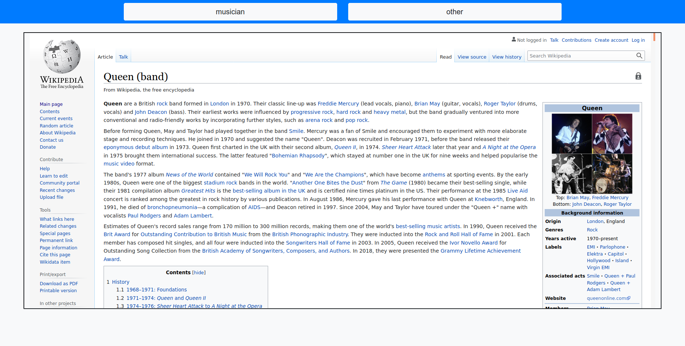

# Music graph

This project aim is the representation of different Wikipedia pages pertaining to various singers or music groups and the links  between its pages in order to explore the relations between different artists in an interactive graph.

A demo of this project can be visualized in https://lmont.es/music-graph.

To use the app you only need to select an artist from the upper selector or click in the node of the graph corresponding to it. The graph can be zoomed in or out using the mouse wheel and can be moved pressing the left mouse button.


**NOTE**: because there are 1.5 K nodes and near 50 K edges the graph rendering is slow.

## Software employed

* [BeautifulSoup](https://www.crummy.com/software/BeautifulSoup/bs4/doc): for HTML parsing and processing.
* [Scikit-learn](https://scikit-learn.org): for machine learning.
* [Networkx](https://networkx.org) and [python-louvain](https://github.com/taynaud/python-louvain): for graph analysis.
* [Bootstrap](https://getbootstrap.com): for web layout and styling
* [Vis.js](http://visjs.org) for graph representation.

## Setup

First of all it's recommended to create a new Python 3 environment and install the required libraries in it.

```bash
python -m venv env
source env/bin/activate
pip install -r requirements.txt
```

Another requirement is to have the `raw-data` directory with `musician`, `other` and `unclassified` subdirectories:

```bash
mkdir -p raw-data/{musician,other,unclassified}
```

In order to reproduce the experiment we can follow two different ways, the first is to start crawling web pages from zero. The other is downloading the tagged dataset and training a machine learning model to help the web crawler to classify the new pages it downloads.
### Start from zero

This process starts with web scrapping, if we follow this way we need to execute the [crawler](crawler.py) script in the first place. This script collects Wikipedia pages from music groups and artists, in order to avoid collecting other pages that don't pertain to groups this script can use a Machine Learning model capable of diferentiate between musician and other pages. This model can only used if we have labelled some data previously and we have trained the model. In other case this script only collects web pages and saves them in the `raw-data/unclassified` directory.

To start the crawler we only need to run the next command:

```bash
python crawler.py
```

Once we have a good number of web pages downloaded we can start the manual classification of the downloaded Wikipedia pages. To ease that process we have created a simple web app that helps us in the task. This app gets the list of files from the `unclassified` folder and shows the corresponding Wikipedia page in an iframe. We can examine the page and classify it pressing one of the top buttons `musician` or `other`. Then the app moves the corresponding file from `unclassified` to `musician` or `other` directory.

To start the app we have to execute the following commands:

```bash
cd tagger
python app.py
```

Once the app has started we can go to the URL http://127.0.0.1:8000 in the web browser a we will see the application shown in the next image:




After tagging the images the sequence of steps is common for the two approximations so these steps will be described in the section **Common steps**.

### Download the dataset

In order to simplify the process we have created a file in the data directory with all the URLs of the pages used and its corresponding classification. This file is named `classes.csv`.

To start downloading the files we only need to execute the [download-data](download-data.py) script:

```bash
python download-data.py
```

**IMPORTANT**: this process only dowloads 2 pages per second in order to not to saturate the Wikipedia web page with requests and to avoid a possible IP blocking.

### Common steps

Once we have downloaded the pages and they are tagged we can follow two possible ways.

If we want to create a Machine Learning model that helps the crawler to get and classify new web pages we need to create a dataset from the pages and train a model, we do this with the next commands:

```bash
python create-dataset.py
python ml-tuning.py
```

**NOTE**: model creation can take some time.

In the other hand, if we only want to visualize the graph we must follow the next steps:

```bash
python create-graph.py
python process-graph.py
```

## Visualization

In order to visualize the graph we have to run the script [visualization/app.py](visualization/app.py):

```bash
cd visualization
python app.py
```

Now we can go to the URL http://127.0.0.1:8080 to see the application. The first time the application is launched it creates the file `static/gdata.js` with the graph nodes and edges and its respective positions. Depending on the machine it can take some time so patience is required.

Next times, to watch the graph there is no need to start the application, only is needed to open the [visualization/index.html](visualization/index.html) file in the browser.

**IMPORTANT**: if we have started from zero or downloaded some new data, to see the last graph version we need to remove the file `static/gdata.js` and start the application to visualize it. This file will be generated again with the new data.

## Machine learning explained

In order to generate the first version of the model was necessary to classify some wikipedia pages, for this purpose was created the [tagger](tagger/app.py) application that presents the different pages and has two buttons to select the correct class.

Once all the pages had been classified  the second step is to generate the dataset for training, that is done with the [create-dataset](create-dataset.py) script.

As the last step, to generate to Machine Learnig model we have to execute the [ml-tuning](ml-tuning.py) script. This script explores different parameters used for model training and saves the model that has the best score. The results for the best model are shown below:

* Model: random forest classifier
* Best score:  0.9643230341867485
* Test accuracy: 0.966

* Parameters:
    * 'cv__ngram_range': (1, 3)
    * 'cv__stop_words': 'english'
    * 'model__max_depth': None
    * 'model__n_estimators': 100

Confusion matrix

||musician| other|
|-|-|-|
| musician | 288 | 20|
| other | 13 | 646|

To use the model we have the class `Classifier` defined in the file [model](model.py). This class is a wrapper of the model and is used to make the predictions. If the model does not exist the prediction is `unclassified` in order to use it in the crawler when there is no model.

Last of all, in order to improve the model it can be trained with more samples following the last described steps.
